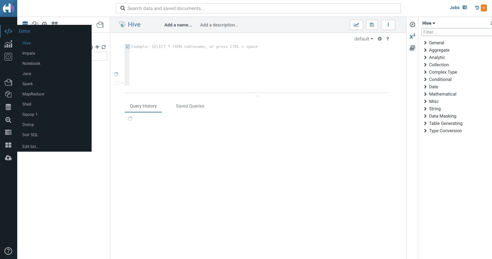
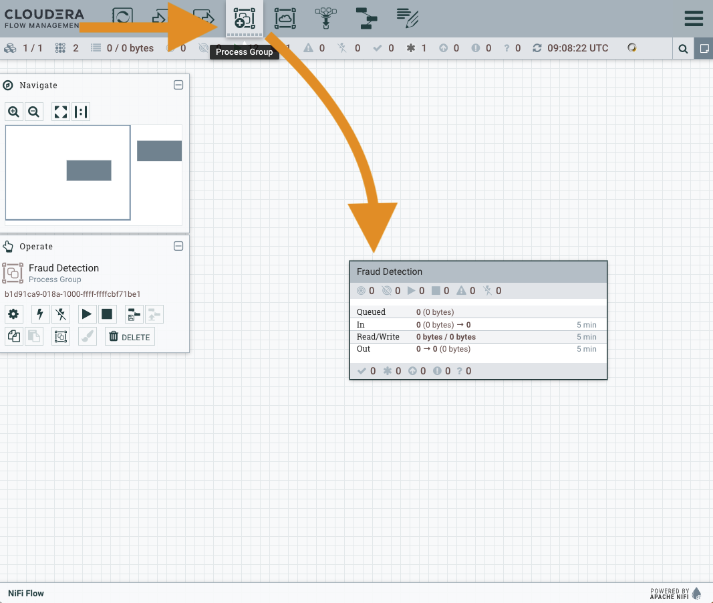
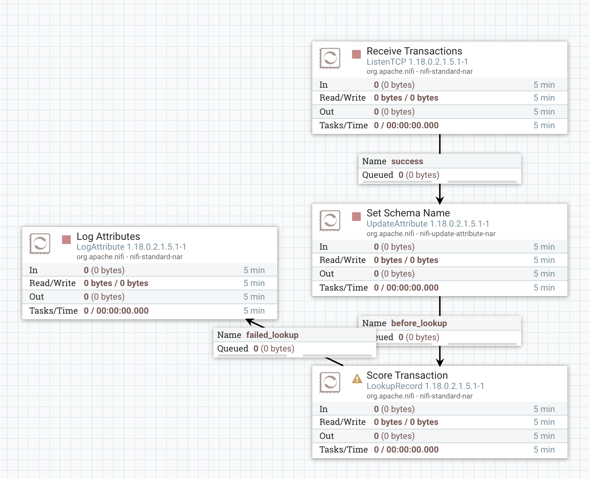
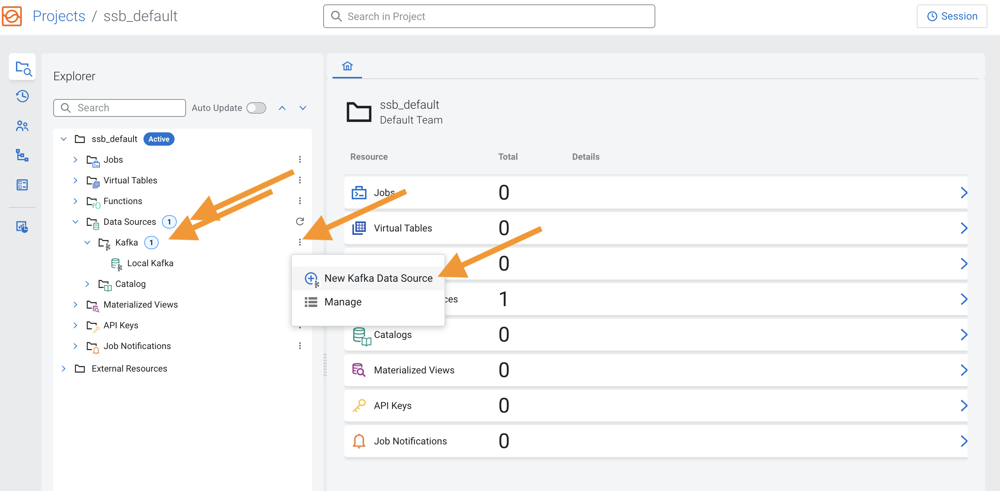
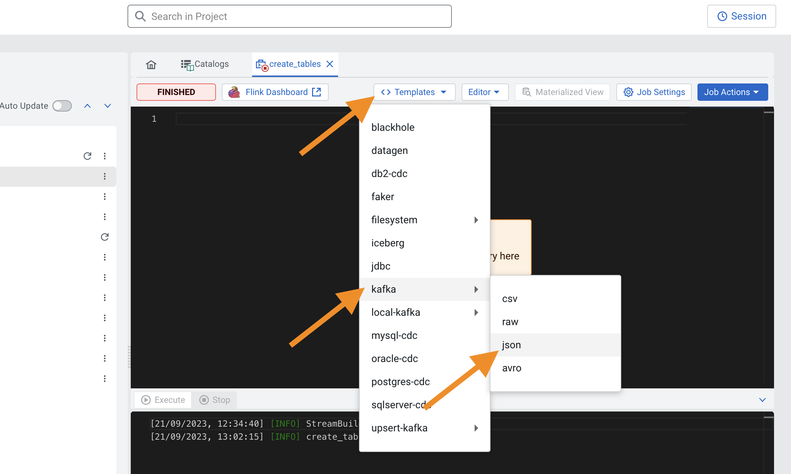

= Credit Card Fraud Detection workshop

You may have recently heard or read stories on health pass fraud , or carbon credit tax fraud (if you watched “Les Rois de l’arnaque” on Netflix ).Frauds always existed throughout human history and detecting fraudulent transactions in whatever the industries involved is one of the classic use cases but also one of the biggest challenges.

## How is Fraud Detection challenged?

Why is fraud a big deal? Well, it's about losing money. According to link:https://www.ftc.gov/news-events/press-releases/2021/02/new-data-shows-ftc-received-2-2-million-fraud-reports-consumers[the Federal Trade Commission], the estimated loses in business organizations is more than $3.3 billion in 2020, an increase of $1.5 billion since 2019 (before COVID19).
A link:https://www.pwc.com/gx/en/services/forensics/economic-crime-survey.html[PwC Global Economic Crime and Fraud Survey] founds that 47% of the 5500 respondents companies experienced a fraud in the past 24 months and  $42 billion is the total fraud losses reported by these companies.

Although many institutions took measures to counter frauds, fraudulent transactions have been soaring in recent years making fraud prevention one of the hottest topics and top challenges for organizations.

Fraud prevention is most effective when you can act on suspicious transactions in real-time. These curated assets offer insights to help you prevent fraud using real-time data, advanced analytics and machine learning.[1].

Traditionally, fraud prevention applications have been deployed using stream processing (Spark streaming or Kafka Streams) and  need core and strong  skills in programming such as Java or Scala. But not all the organizations are well staffed and this reduces who can access the stream processing framework.
Luckily, Cloudera released SQL Stream Builder (running on Flink, available with the Cloudera Stream Analytics) that allows data analytics teams to easily build robust real-time streaming pipelines. Cloudera Streaming SQL Builder (SSB) helps in democratizing streaming data using the power and the maturity of the SQL language, so now everyone can write stream analytics applications.

== Preparation

This demo uses link:https://account.mapbox.com/[MapBox] to show the distribution of fraud occurrences on an interactive map.
To enable this a MapBox token is required so that Cloudera DataViz can connect to the MapBox service.
If you don't yet have a token, click on the MapBox link above, sign up for free and create a token for yourself.

To deploy the full demo with *skipping all the steps below*, please SSH to your cluster host 

[source,shell]
----
ssh centos@cdp.<HOST_IPADDRESS>.nip.io
----

and run the following command:

NOTE: The command below will undo everything done in the cluster in previous workshops.

[source,shell]
----
MAPBOX_TOKEN=<your_mapbox_token> /tmp/resources/reset-to-lab.sh fraud 99
----

== The use case

Fraud detection is a great example of a time-critical use case for us to explore. We all have been through a situation where the details of our credit card, or the card of someone we know, has been compromised and illegitimate transactions were charged to the card. To minimize the damage in that situation, the credit card company must be able to identify potential fraud immediately so that it can block the card and contact the user to verify the transactions and possibly issue a new card to replace the compromised one.

The card transaction data usually comes from event-driven sources, where new data arrives as card purchases happen in the real world. Besides the streaming data though, we also have traditional data stores (databases, key-value stores, object stores, etc.) containing data that may have to be used to enrich the streaming data. In our use case, the streaming data doesn’t contain account and user details, so we must join the streams with the reference data to produce all the information we need to check against each potential fraudulent transaction.

Depending on the downstream uses of the information produced we may need to store the data in different formats: produce the list of potential fraudulent transactions to a Kafka topic so that notification systems can action them without delay; save statistics in a relational or operational dashboard, for further analytics or to feed dashboards; or persist the stream of raw transactions to a durable long-term storage for future reference and more analytics.

We will implement the following:

1. Apache NiFi will read a stream of transactions sent over the network.
2. For each transaction, NiFi makes a call to a production model in Cloudera Data Science Workbench (CDSW) to score the fraud potential of the transaction.
3. If the fraud score is above a certain threshold, NiFi immediately routes the transaction to a Kafka topic that is subscribed by notification systems that will trigger the appropriate actions.
4. The scored transactions are written to the Kafka topic that will feed the real-time analytics process that runs on Apache Flink.
5. The transaction data augmented with the score is also persisted to an Apache Kudu database for later querying and feed of the fraud dashboard.
6. Using SQL Stream Builder (SSB), we use continuous streaming SQL to analyze the stream of transactions and detect potential fraud based on the geographical location of the purchases.
7. The identified fraudulent transactions are written to another Kafka topic that feeds the system that will take the necessary actions.
8. The streaming SQL job also saves the fraud detections to the Kudu database.
9. A dashboard feeds from the Kudu database to show fraud summary statistics.

== Labs summary

* *Lab 1* - Registering a schema in Schema Registry
* *Lab 2* - Create the Kafka topics in *Streams Messaging Manager (SMM)*
* *Lab 3* - Create Kudu tables for storing the transactions, customers and fraudulent transactions data
* *Lab 4* - Create the NiFi Flow
* *Lab 5* - Create SSB Kafka data provider
* *Lab 6* - Create SSB Kudu data provider
* *Lab 7* - Create table connections (virtual tables) in SQL Stream Builder
* *Lab 8* - Create JavaScript functions in SQL Stream Builder
* *Lab 9* - Run the fraud detection job in SQL Stream Builder
* *Lab 10* - Create connection in DataViz to access and visualize the fraudulent transactions in Kudu
* *Lab 11* - Import DataViz visual and observe the dashboard

[[lab_1, Lab 1]]
== Lab 1 - Registering a schema in Schema Registry

The transaction data is described by the schema this  https://gist.githubusercontent.com/asdaraujo/e680557100b82d5e0004d7b9f4e3b4f7/raw/f7192cb27e61035fa26156881980342bf385fd2f/transaction.avsc[file]. In this lab we will register this schema in Schema Registry so that our flows in NiFi can refer to schema using an unified service. This will also allow us to evolve the schema in the future, if needed, keeping older versions under version control, so that existing flows and flowfiles will continue to work.

. Go to the following URL, which contains the schema definition we'll use for this lab. Select all contents of the page and copy it.
+
link: https://gist.githubusercontent.com/asdaraujo/e680557100b82d5e0004d7b9f4e3b4f7/raw/f7192cb27e61035fa26156881980342bf385fd2f/transaction.avsc[Schema]

. In the Schema Registry Web UI, click the `+` sign to register a new schema.

. Click on a blank area in the *Schema Text* field and paste the contents you copied.

. Complete the schema creation by filling the following properties and save the schema.
+
[source,yaml]
----
Name:          transactions
Description:   Schema for the incoming transaction data
Type:          Avro schema provider
Schema Group:  Kafka
Compatibility: Backward
Evolve:        checked
----
+

[[lab_2, Lab 2]]
== Lab 2 - Create the Kafka topics in Streams Messaging Manager (SMM)

To clean your environment and reset to the beginning of this lab, please SSH to your cluster

[source,shell]
----
ssh centos@cdp.<HOST_IPADDRESS>.nip.io
----

and run the following command:

NOTE: The command below will undo everything done in the cluster in previous workshops.

[source,shell]
----
/tmp/resources/reset-to-lab.sh fraud 2
----

In this lab, you will access the SMM and create a topic called *transactions*. 

. Open the Streams Messaging Manager UI
. On the left pane select "Topics"
. On the upper right corner select "Add new" 
. On the Add Topic window provide the following: 
+
[source,yaml]
----
TOPIC NAME:     transactions
PARTITIONS:     10
AVAILABILITY:   LOW
CLEANUP POLICY: delete
----
+

+
In the Topics, scroll down to the transactions topic and click on the "Profile" icon, and observe the METRICS, DATA EXPLRER, CONFIG, LATENCY tabs. Later on we will come back when we are pushing data to the transactions Kafka topic and monitor it. 

+

[[lab_3, Lab 3]]
== Lab 3 - Create Kudu tables for storing the transactions and fraudulent transactions data

To clean your environment and reset to the beginning of this lab, please SSH to your cluster

[source,shell]
----
ssh centos@cdp.<HOST_IPADDRESS>.nip.io
----

and run the following command:

NOTE: The command below will undo everything done in the cluster in previous workshops.

[source,shell]
----
/tmp/resources/reset-to-lab.sh fraud 3
----

In this lab, you will create Kudu tables and get familiar with the syntax with Impala in HUE and upload the customers table from external csv source. 

=== Open HUE and create Kudu tables

Before we are creating the Kudu tables open HUE and get familiar with the Hadoop User Interface which is also serving an entrypoint for Ozone object storage in the new releases. 

. Open HUE 
. On the left pane go through the options, such as Editor, where you can select the necessary engines and access the editors not only for Impala and Hive but also visually initiate Spark and Java jobs
+

. Check other functions in the list such as Scheduler which server as a frontend for Oozie for orchestrating and scheduling Spark jobs on CDP Base and also Hbase browser which provides an entrypoint for browsing tables in the operational database in CDP
. Go to Editor and select "Impala" 
. On the left side you will see the database name (in this case "default" and in the center the editor itself. 
. Copy the following code and execute it, check the difference between original and Kudu table creation. In our newest release of CDP there is no requirement for creating unique keys, in case of non unique key selection the system will automaticall generate an incremental value for the table:  
+
[source,sql]
----
CREATE TABLE IF NOT EXISTS transactions
(
ts string,
acc_id string,
transaction_id string,
amount bigint,
lat double,
lon double,
fraud_score double,
PRIMARY KEY (ts, acc_id)
)
PARTITION BY HASH PARTITIONS 16
STORED AS KUDU
TBLPROPERTIES ('kudu.num_tablet_replicas' = '1');
----
+

+
[source,sql]
----
CREATE TABLE IF NOT EXISTS customers
(
acc_id string,
f_name string,
l_name string,
email string,
gender string,
phone string,
card string,
PRIMARY KEY (acc_id)
)
PARTITION BY HASH PARTITIONS 16
STORED AS KUDU
TBLPROPERTIES ('kudu.num_tablet_replicas' = '1')
----

+
[source,sql]
----
CREATE TABLE IF NOT EXISTS fraudulent_txn
(
event_time string,
acc_id string,
transaction_id string,
f_name string,
l_name string,
email string,
gender string,
phone string,
card string,
lat double,
lon double,
amount bigint,
PRIMARY KEY (event_time, acc_id)
)
PARTITION BY HASH PARTITIONS 16
STORED AS KUDU
TBLPROPERTIES ('kudu.num_tablet_replicas' = '1')
----
+

. On the HUE UI navigate to the left pane and open "Importer" and download the link:customers_temp.csv[customers_temp.csv] from the git and drag&drop it to the importer UI.

+

. Proceed with clicking on "Next" at the bottom left on the page
. Set the following: 
+
[source,yaml]
----
Type:     Table
Name:     default.customers_temp
Format:   Text
And modify all types to String type per column
----
. Click on "Submit"
. Wait until the jobs are finished, you can check them in the up right corner by clicking on the "Jobs" icon
. Go back to the Editor - Impala and run the following query: 
+
[source,sql]
----
INSERT INTO default.customers
SELECT * FROM default.hue__tmp_customers_temp
----
+
and run 
+
[source,sql]
----
SELECT * FROM customers LIMIT 100;
----
+
To validate that the data from the previous tables have been inserted into the Kudu table. 
+

+
You have finished this lab, you can try and run queries and check the Impala query plan by clicking to the code under the editor: 
+

[[lab_4, Lab 4]]
== Lab 4 - Create the NiFi Flow

To clean your environment and reset to the beginning of this lab, please SSH to your cluster

[source,shell]
----
ssh centos@cdp.<HOST_IPADDRESS>.nip.io
----

and run the following command:

NOTE: The command below will undo everything done in the cluster in previous workshops.

[source,shell]
----
/tmp/resources/reset-to-lab.sh fraud 4
----

=== Creating a Process Group

. Open the NiFi Web UI, create a new Process Group and name it something like *Fraud Detection*.
+

. We want to be able to version control the flows we will add to the Process Group. In order to do that, we first need to connect NiFi to the *NiFi Registry*. On the NiFi global menu, click on "Controller Settings", navigate to the "Registry Clients" tab and add a Registry client with the following URL:
+
[source,yaml]
----
Name: NiFi Registry
URL:  http://<CLUSTER_HOSTNAME>:18080
----
+

+

. Go to the *NiFi Registry* Web UI, add a bucket by clicking on the spanner icon on the top right corner and hit "NEW BUCKET"  for storing the Fraud Detection flow we're about to build'. Call it `FraudFlow`:
+

+

. Back on the *NiFi* Web UI, to enable version control for the Process Group, right-click on it and select *Version > Start version control* and enter the details below. Once you complete, a  will appear on the Process Group, indicating that version control is now enabled for it.

+
[source,yaml]
----
Registry:  NiFi Registry
Bucket:    FraudFlow
Flow Name: FraudDetectionPG
----

+

. Let's also enable processors in this Process Group to use schemas stored in Schema Registry. Right-click on the Process Group, select *Configure* and navigate to the *Controller Services* tab. Click the *`+`* icon and add a *HortonworksSchemaRegistry* service. After the service is added, click on the service's _cog_ icon (), go to the *Properties* tab and configure it with the following *Schema Registry URL* and click *Apply*.
+
[source,yaml]
----
URL: http://<CLUSTER_HOSTNAME>:7788/api/v1
----
+

. Click on the _lightning bolt_ icon (image:images/fraud/enable_icon.png[width=20]) to *enable* the *HortonworksSchemaRegistry* Controller Service.

. Still on the *Controller Services* screen, let's add four additional services to handle the reading and writing of JSON records and one for RestLookup service. Click on the  button and add the following four services:
** *`JsonTreeReader`*, (this will be used for Kafka, QueryRecord and LookupRecord processors) with the following properties:
+
[source,yaml]
----
Schema Access Strategy: Use 'Schema Name' Property
Schema Registry:        SchemaRegistry or HortonworksSchemaRegistry
Schema Name:            ${schema.name} -> already set by default!
----

** *`JsonTreeReader`*, (this will be used to write to Kudu tables) with the following properties:
+
[source,yaml]
----
Schema Access Strategy: Infer schema
----

** *`JsonRecordSetWriter`*, (this will be used for Kafka and LookupRecord processors) with the following properties:
+
[source,yaml]
----
Schema Write Strategy:  HWX Schema Reference Attributes
Schema Access Strategy: Use 'Schema Name' Property
Schema Registry:        SchemaRegistry or HortonworksSchemaRegistry
----

** *`JsonRecordSetWriter`*, (this will be used for QueryRecord processor) with the following properties:
+
[source,yaml]
----
Schema Write Strategy:    Do Not Write Schema
Schema Access Strategy:   Inherit Record Schema
Pretty Print JSON:        false
Suppress Null Values:     Never Suppress
Output Grouping:          Array
Compression Format:       none
----

** *`RestLookupService`*, with the following properties:
+
[source,yaml]
----
URL:                       #{model.endpoint.url}
Record Reader:             JsonTreeReader - Use schema.name
Record Path:               /
Use Digest Authentication: false
Connection Timeout:        5 secs
Read Timeout:              15 secs
----

. Enable all the Controller Services you just created, by clicking on their respective _lightning bolt_ icons (image:images/fraud/enable_icon.png[width=20]). This should be the output after enabling the controller services:  

+

. Double-click on the newly created process group to expand it.

=== Uploading a previously created flow which generates the transaction data and handles the ML model requests

. In this step we are going to upload the Data Generators process group from JSON flow definition. For this download the link:Generators.json[Generators.json] to local computer, create new Process Group by dragging the icon the the editor and in the popup window select the Browse icon at the end of the Name field and open the downloaded link:Generators.json[Generators.json]. 

+

+
You will see the following warnings, these are because it is requiring a StandardHttPContextMap Controller:

+

. Right-click on the Process Group, select *Configure* and navigate to the *Controller Services* tab. You will notice that the Controller has been added to the list, click on the _lightning bolt_ icon (image:images/fraud/enable_icon.png[width=20]) to *enable* the *StandardHttpContextMap* Controller Service.

. To go back to the previous canvas, on the bottom of the page find the Process Group list: "Nifi Flow - Fraud Detection - Generators" and click on *Fraud Detection*. 

=== Creating the Fraud Detection Nifi Flow

In the following steps we are going to use different processors, configuring and connecting them according to the task what we would like to perform in the pipeline. 

. First for receiving the transaction drag the "ListenTCP" processor to the canvas: 

+

. Right-click on the Processor and select *Configure* and on the *Settings* tab set the name to "Receive Transactions" and then navigate to the *Properties* tab and add the following: 

+
[source,yaml]
----
Port: #{input.port}
----

. We need to tell NiFi which schema should be used to read and write the Sensor data. For this we'll use an _UpdateAttribute_ processor to add an attribute to the FlowFile indicating the schema name. Drag a new processor to the canvas, search for "UpdateAttribute" and hit *ADD*, right-click on the Processor and select *Configure* and on the *Settings* tab set the name to "Set Schema Name" and then navigate to the *Properties* tab and click on the *+* sign to add a new property

+

+
In the new window add the following Property name: 
+
[source,yaml]
----
schema.name
----
+
and in the next window add the following Value to it: 
+
[source,yaml]
----
#{schema.name}
----
+
and click *OK*. 

+

. Now connect to the processors by hovering with the mouse over to the Receive Transactions processors and you will see a logo in its center, drag it to the Set Schema Name processor: 

+

. A new window will open, on the *Details* tab check the *For relationships* box to be checked. Hit *ADD*. You will see the following: 

+

. We need to call our model to receive the prediction if the transaction is fraudulent or not, for this drag a new processor to the canvas, search for "LookupRecord" and hit *ADD*, right-click on the Processor and select *Configure* and on the *Settings* tab set the name to "Score Transactions" and then navigate to the *Properties* tab and set the following Values to the Properties:

+
[source,yaml]
----
Record Reader: JsonTreeReader - Use schema.name
Record Writer: JsonRecordSetWriter - Use schema.name
Lookup Service: RestLookupService
Result RecordPath: /model_response
----
+
and click on the *+* to add a new Properties with the following Values: 
+
[source,yaml]
----
mime.type:      toString('application/json', 'UTF-8')
request.body:   concat('{"request":{"feature":"', /ts, ', ', /account_id, ', ', /transaction_id, ', ', /amount, ', ', /lat, ', ', /lon, '"}}')
request.method: toString('post', 'UTF-8')
----

. Connect the *Set Schema name* processor to the *Score Transaction* processor, on the *Settings* pane of the Create Connection name it: *before_lookup* and hit *ADD*. 

. During scoring, we have to take of the failed lookups and log them. For this create a new processors *LogAttribute*, name it: *Log Attribute* and create a connection between it and the *Score Transaction* processor, on the Create Connection page check the *For Relationships* only the "Failure" checkbox has been ticked and name it on the *Settings* pane to "failed_lookup". 

+

+
Now the canvas should look like this: 

+

. Now we are going to query the results of the lookup, and depending on the results of the queries we will publish the data to different Kafka topics and Kudu table. For this we are going to use the powerful *QueryRecord* Processor, drag it to the canvas and set it's name to "Check Transaction Score", on the Properties pane set the following Values to the Properties: 

+
[source,yaml]
----
Record Reader: JsonTreeReader - Use schema.name
Record Writer: JsonRecordSetWriter - Inherit record schema
Include Zero Record FlowFiles: false
----
+
And add the following properties with the *+*:

+
[source,yaml]
----
Property: flattened
Value: 
select
  ts,
  account_id,
  transaction_id,
  amount,
  lat,
  lon,
  RPATH(model_response, '/fraud_score') as fraud_score
from flowfile
----

+
[source,yaml]
----
Property: likely_fraud:
Value: 
select
  ts,
  account_id,
  transaction_id,
  amount,
  lat,
  lon,
  RPATH(model_response, '/fraud_score') as fraud_score
from flowfile
where RPATH(model_response, '/fraud_score') > 0.90
----

+
[source,yaml]
----
Property: to_kudu: 
Value: 
select
  ts,
  account_id as acc_id,
  transaction_id,
  amount,
  lat,
  lon,
  RPATH(model_response, '/fraud_score') as fraud_score
from flowfile
----

+
Now observe the queries, you can see how easy is to create queries and based on the output we will route the data to different sinks. In this step we are avoiding splitting the data to rows and creating individual flowfiles for each row and later on merge them together because it would lead to excessive resource usage and this can be done much more easier and faster with this processor. 

. Connect the "Check Transaction Score" to the "Log Attribute" processor and select the "failure", name it on the Settings panel to "failed_query" and hit *ADD*. 

. Connect the *Score Transaction* processor to the *Check Transaction Score* processor, relationship should be "success" and name it "lookup_output". 
+
In the following steps we are going to publish the results of the query to their destination, for this we are going to create 3 processors, one will be a Kafka topic named transactions this will store the results of the flattened transaction, the second one will put the data to kudu (the result of the to_kudu query) and the third will be again putting the data to Kafka, but this time it will put the likely_fraud query output to the frauds topic. 

. Create a new processor: *PublishKafkaRecord_2_6* with the following settings: 

+
Settings Tab: 
+
[source,yaml]
----
Name: Publish to Kafka topic: transactions
----
+
Properties Tab: 
+
[source,yaml]
----
Kafka Brokers: #{kafka.brokers}
Topic Name: #{transaction_topic}
Record Reader: JsonTreeReader - Use schema.name
Record Writer: JsonRecordSetWriter - Use schema.name
Use Transactions: false
Security Protocol: #{kafka.security.protocol}
SASL Mechanism: #{kafka.sasl.mechanism}
----
+
On the "Relationships" tab set "Automatically Terminate" and *terminate* on *success* 

+

. Connect the *Check Transaction Score* to the *Publish to Kafka topic: transactions* processor and select the *flattened* relationship. 

. If you publish Kafka Record in NiFi to a non-existing topic, it will be created, we are going to use this feature and at the end of this lab we are going to observe the topics in *SMM*, so in this step create a new processor: *PublishKafkaRecord_2_6* with the following settings: 
+
Settings Tab: 

+
[source,yaml]
----
Name: Publish to Kafka topic: frauds
----
+
Properties Tab: 

+
[source,yaml]
----
Kafka Brokers: #{kafka.brokers}
Topic Name: #{fraud_topic}
Record Reader: JsonTreeReader - Use schema.name
Record Writer: JsonRecordSetWriter - Use schema.name
Use Transactions: false
Security Protocol: #{kafka.security.protocol}
SASL Mechanism: #{kafka.sasl.mechanism}
----
+
On the "Relationships" tab set "Automatically Terminate" and *terminate* on *success* 

. Connect the *Check Transaction Score* to the *Publish to Kafka topic: frauds* processor and select the *likely_fraud* relationship. 

. We are going to create a processor which loads the data to Kudu, for this create the *PutKudu* processor with the following settings:

+
Settings Tab: 

+
[source,yaml]
----
Name: Write to Kudu
----
+
Properties Tab: 

+
[source,yaml]
----
Kudu Masters: #{kudu.master}
Table Name: #{transaction_table}
Record Reader: JsonTreeReader - Infer schema
Kudu Operation Type: UPSERT
----
+
On the "Relationships" tab set "Automatically Terminate" and *terminate* on *success* 

. Connect the *Check Transaction Score* to the *Write to Kudu* processor and select the *to_kudu* relationship. 
+
Now the final NiFi flow should look similar to this flow: 

+

. Go back to the main *Fraud Detection* Process Group and hit right click on it and *Start*. 

. Now open *SMM* and on the left pane click *Topics* and search for *transactions* and also *fraudulent_txn*. 

. Click on *Profile*

+

. Select the tabs on the top, *Metrics* are for giving us an overview about the producers and consumers together with the information of partitions and data in and out gauge. *Data Explorer* lets us view the actual data in the topic, on *Configs* you can see the configuration of the topic and the selected availability option, cleanup policy. 

+

[[lab_5, Lab 5]]
== Lab 5 - Create SSB Kafka data provider

To clean your environment and reset to the beginning of this lab, please SSH to your cluster

[source,shell]
----
ssh centos@cdp.<HOST_IPADDRESS>.nip.io
----

and run the following command:

NOTE: The command below will undo everything done in the cluster in previous workshops.

[source,shell]
----
/tmp/resources/reset-to-lab.sh fraud 5
----

=== SQL Stream Builder

. Open SQL Stream Builder UI, login with the credentials and you will see the following page: 
+

+
Observe the UI, on the opening page you can see the Projects, the ssb_default is the all time default Team which serves as a starting point for all users. If users have access to the SSB then they can also create projects and invite others to join their Projects with specific rights. This tool has been built for collaboration and provides also Git integration for teamwork. 

. Click "Open" on the ssb_default team. 

+

. In the *Explorer* on the left pane click on *Data Sources* and *Kafka* and click on the three dots at the end of the line and hit *New Kafka Data Source*. 

+

+
Set the following: 

+
[source,yaml]
----
Name: edge2ai-kafka
Brokers: cdp.<HOST_IPADDRESS>.nip.io:9092
Protocol: PLAINTEXT
----
+
Click on *Validate* and on *Create* if Data Source is valid. 

[[lab_6, Lab 6]]
== Lab 6 - Create SSB Kudu data provider

To clean your environment and reset to the beginning of this lab, please SSH to your cluster

[source,shell]
----
ssh centos@cdp.<HOST_IPADDRESS>.nip.io
----

and run the following command:

NOTE: The command below will undo everything done in the cluster in previous workshops.

[source,shell]
----
/tmp/resources/reset-to-lab.sh fraud 6
----

We are going to add Kudu data connection, to be able to interact with Kudu tables from SSB directly. 

. In the *Explorer* on the left pane click on *Data Sources* and *Catalog* and click on the three dots at the end of the line and hit *New Catalog*. 

+

+
Set the following: 
+
[source,yaml]
----
Catalog Type: Kudu
Name: edge2ai-kudu
Kudu Masters: cdp.<HOST_IPADDRESS>.nip.io:7051
Database Filter: .*
Table Filter: .*
----

+
. Click on the *+* at the end of the row to add the Filter: 

+

+
. Click on *Validate* and on *Create* if Data Source is valid. 

[[lab_7, Lab 7]]
== Lab 7 - Create SSB Tables

To clean your environment and reset to the beginning of this lab, please SSH to your cluster

[source,shell]
----
ssh centos@cdp.<HOST_IPADDRESS>.nip.io
----

and run the following command:

NOTE: The command below will undo everything done in the cluster in previous workshops.

[source,shell]
----
/tmp/resources/reset-to-lab.sh fraud 7
----

In this lab we are going to create virtual tables which are serving as connectors to the sources, you will see how easy it is to create connection to external data sources. 
We are going to create one virtual table for connecting to Kafka and one for the Kudu. 

=== Creating virtual table to connect to Kafka

. Go to the *Jobs* on the left pane, click on the three dots end of the row and click on *New Job*. 

+

. Add the name: "create_tables" and hit *Create*

. Now you will see the editor on the UI, there are built in templates to make it easier to create connection to external sources or sinks, go to the *Templates* on the top of the editor and select *Kafka* and *json* from the menu. 

+

. As you can see you can create tables individually but also multiple one in the same editor, so modify the code in the editor to the following: 

+
[source,yaml]
----
CREATE TABLE fraudulent_txn (
  `event_time` VARCHAR(2147483647),
  `diff_ms` BIGINT,
  `account_id` VARCHAR(2147483647),
  `txn1_id` VARCHAR(2147483647),
  `txn2_id` VARCHAR(2147483647),
  `amount` INT,
  `lat` DOUBLE,
  `lon` DOUBLE,
  `lat1` DOUBLE,
  `lon1` DOUBLE,
  `distance` DECIMAL(32, 16),
  `f_name` VARCHAR(2147483647),
  `l_name` VARCHAR(2147483647),
  `email` VARCHAR(2147483647),
  `card` VARCHAR(2147483647),
  `gender` VARCHAR(2147483647),
  `phone` VARCHAR(2147483647)
) WITH (
  'connector' = 'kafka: edge2ai-kafka',
  'format' = 'json',
  'scan.startup.mode' = 'latest-offset',
  'topic' = 'fraudulent_txn'
)
;

CREATE TABLE transactions (
  `ts` BIGINT,
  `account_id` VARCHAR(2147483647),
  `transaction_id` VARCHAR(2147483647),
  `amount` INT,
  `lat` DOUBLE,
  `lon` DOUBLE,
  `fraud_score` DOUBLE,
  `model_response` ROW<`fraud_score` DOUBLE>,
  `event_time` AS CAST(from_unixtime(floor(`ts`/1000)) AS TIMESTAMP(3)),
  WATERMARK FOR `event_time` AS `event_time` - INTERVAL '3' SECOND
) WITH (
  'connector' = 'kafka: edge2ai-kafka',
  'scan.transform.js.code' = 'var parsed = JSON.parse(record.value); parsed.ts = new java.text.SimpleDateFormat(''yyyy-MM-dd HH:mm:ss'').parse(parsed.ts).getTime(); JSON.stringify(parsed);',
  'format' = 'json',
  'topic' = 'transactions',
  'scan.startup.mode' = 'latest-offset'
)
;
----

. Click on *Execute* at the bottom of the Editor and you will see *[INFO] Active job stopped* in the Log. 

. Click on the *Virtual Tables* on the left pane and observe the created virtual tables, you can see the details and the chema inforamtion as well along with the DDL. 

[[lab_8, Lab 8]]
== Lab 8 - Create SSB Tables

To clean your environment and reset to the beginning of this lab, please SSH to your cluster

[source,shell]
----
ssh centos@cdp.<HOST_IPADDRESS>.nip.io
----

and run the following command:

NOTE: The command below will undo everything done in the cluster in previous workshops.

[source,shell]
----
/tmp/resources/reset-to-lab.sh fraud 8
----

In this lab we are going to add custom JavaScript dunction that we are going to use later on in our queries. Since our dataset has GEO coordinates and we need to measure the distance between coordinates we need to calculate Haversine distance between two geographical coordinates. Also we need a function for converting String to Kudu format. 

. Go to *Functions* on the left pane, click on the three dots and *New Function* and a new editor opens
. Add the following on the UI: 

+
[source,yaml]
----
Name: HAVETOKM
Description: Calculates Haversine distance between two geographical coordinates.
Output type: DECIMAL
Input types: 
DECIMAL
DECIMAL
DECIMAL
DECIMAL

Function (JavaScript ): 
function HAVETOKM(lat1,lon1,lat2,lon2) {
  function toRad(x) {
    return x * Math.PI / 180;
  }

  var R = 6371; // km
  var x1 = lat2 - lat1;
  var dLat = toRad(x1);
  var x2 = lon2 - lon1;
  var dLon = toRad(x2)
  var a = Math.sin(dLat / 2) * Math.sin(dLat / 2) +
    Math.cos(toRad(lat1)) * Math.cos(toRad(lat2)) *
    Math.sin(dLon / 2) * Math.sin(dLon / 2);
  var c = 2 * Math.atan2(Math.sqrt(a), Math.sqrt(1 - a));
  var d = R * c;

  // convert to string
  return d;
}
HAVETOKM($p0, $p1, $p2, $p3);  // this line must exist
----
+
Click on *Save*

+
image::images/fraud/lab8_ssb1_havetokm.png[width=800]

. Again add a *New Function* with the following: 

+
[source,yaml]
----
Name: TO_KUDU_STRING
Description: Convert String to Kudu format. 
Output type: String
Input types: String

Function (JavaScript ): 
function TO_KUDU_STRING(input){
   return input;
}
TO_KUDU_STRING($p0);  // this line must exist
----
+
Click on *Save*

+

[[lab_9, Lab 9]]
== Lab 9 - Create and run Fraud analytics Job

To clean your environment and reset to the beginning of this lab, please SSH to your cluster

[source,shell]
----
ssh centos@cdp.<HOST_IPADDRESS>.nip.io
----

and run the following command:

NOTE: The command below will undo everything done in the cluster in previous workshops.

[source,shell]
----
/tmp/resources/reset-to-lab.sh fraud 9
----

In this lab we are going to create the Fraud analytics Job, to detect a fraudulent transaction, we will implement the following pattern:

* we will consider two transactions with the same "account_id"
** occurring in 2 different locations,
** With a distance greater than *1 KM*,
** And with less than 10 minutes between them.
* Enrichment of the detected fraud transactions with some constant metadata stored in an apache  Kudu table called "customers" and write back the full enriched stream into another apache kudu table called "fraudulent_txn".
* SQL Stream Builder offers the capability to materialize results from a Streaming SQL query to a persistent view of the data that can be read through REST. You can also try to create Materialized  View (MV) feature in SSB to expose the fraudulent data to external applications and even create queries which can be customised in the URL pattern. 

. Click on the three dots at the end of the *Jobs* on the left pane, hit *New Job*
. Name the *Job* as fraud_detection_job and hit *Create*
. In the editor copy the following code: 

+
[source,sql]
----
DROP TEMPORARY VIEW IF EXISTS frauds;
CREATE TEMPORARY VIEW frauds AS
SELECT
  cast(txn1.event_time as string) as event_time,
  txn2.ts - txn1.ts as diff_ms,
  txn1.account_id,
  txn1.transaction_id as txn1_id,
  txn2.transaction_id as txn2_id,
  txn2.amount,
  txn2.lat,
  txn2.lon,
  txn1.lat as lat1,
  txn1.lon as lon1,
  HAVETOKM(txn1.lat, txn1.lon, txn2.lat, txn2.lon) as distance,
  c.f_name, c.l_name, c.email, c.card, c.gender, c.phone
FROM transactions as txn1
JOIN transactions as txn2
  ON txn1.account_id = txn2.account_id
JOIN `edge2ai-kudu`.`default_database`.`default.customers` as c
  ON c.acc_id = txn1.account_id
WHERE txn1.transaction_id <> txn2.transaction_id
  AND txn2.event_time BETWEEN txn1.event_time AND txn1.event_time + INTERVAL '10' MINUTE
  AND HAVETOKM(txn1.lat, txn1.lon, txn2.lat, txn2.lon) > 1
;

INSERT INTO fraudulent_txn
SELECT *
FROM frauds
;

INSERT INTO `edge2ai-kudu`.`default_database`.`default.fraudulent_txn` (event_time, acc_id, transaction_id, f_name, l_name, email, gender, phone, card, lat, lon, amount)
SELECT
  to_kudu_string(event_time),
  to_kudu_string(account_id),
  to_kudu_string(txn2_id),
  to_kudu_string(f_name),
  to_kudu_string(l_name),
  to_kudu_string(email),
  to_kudu_string(gender),
  to_kudu_string(phone),
  to_kudu_string(card),
  lat,
  lon,
  amount
FROM frauds
;
----

. Open the *Job settings* located at the upper right corner of the editor: 

+

+
. On the UI you will see the Job settings, 
** set the *Sample Behaviour* to "Sample all messages" 
** *Sample Count* and *Sample Window Size* to 0 from 100
** turn on the *Restore From Savepoint* 

. Go back to the editor and hit *Execute* and observe the output. You can also open the *Flink Dashboard* by clicking on the Flink Dashboard icon on the top of the editor. 
+

. *Leave the job in running state.* 

[[lab_10, Lab 10]]
== Lab 10 - Create connection in DataViz to access and visualize the fraudulent transactions in Kudu

To clean your environment and reset to the beginning of this lab, please SSH to your cluster

[source,shell]
----
ssh centos@cdp.<HOST_IPADDRESS>.nip.io
----

and run the following command:

NOTE: The command below will undo everything done in the cluster in previous workshops.

[source,shell]
----
/tmp/resources/reset-to-lab.sh fraud 10
----

In this lab we are going to use Cloudera DataViz tool to establish connection with Impala to Kudu. 

CDSW is the predecessor of *CML - Cloudera Machine Learning* which enables enterprise data science teams to collaborate across the full data lifecycle with immediate access to enterprise data pipelines, scalable compute resources, and access to preferred tools. Streamline the process of getting analytic workloads into production and intelligently manage machine learning use cases across the business at scale.

*CDP Machine Learning* optimizes ML workflows across your business with native and robust tools for deploying, serving, and monitoring models. With extended SDX for models, govern and automate model cataloging and then seamlessly move results to collaborate across CDP experiences including Data Warehouse and Operational Database.

. Open Cloudera Data Science Workbench (CDSW) and you will see the followng welcome page, click on the *VizApps Workshop* previously automatically generated project: 

+

. On the left pane select the *Applications*

+

. Select the *Viz Server Application* and it will redirect you to the Cloudera Data Viz which is running inside the containerized environment. 

. Open the *Connections* on the top to create a connection to our Kudu table

+
image::images/fraud/lab10_dviz1_conn.png[width=800]

. Click on *New connection* at the top left of the UI
** Select *Impala* as connection Type
** Name the connection as *Impala*

** On the *Basic* tab add your hostname, and port: 21050

+
image::images/fraud/lab10_dviz2_conn.png[width=800]

** On the *Advanced* tab select: 
*** Connection mode: Binary
*** Socket type: Normal
*** Authentication mode: NoSasl
** Hit *Test* and after connection is verified click on *Connect* 

+
image::images/fraud/lab10_dviz3_conn.png[width=800]

[[lab_11, Lab 11]]
== Lab 11 - Import DataViz visual and observe the dashboard

To clean your environment and reset to the beginning of this lab, please SSH to your cluster

[source,shell]
----
ssh centos@cdp.<HOST_IPADDRESS>.nip.io
----

and run the following command:

NOTE: The command below will undo everything done in the cluster in previous workshops.

[source,shell]
----
/tmp/resources/reset-to-lab.sh fraud 11
----

In this lab we are going to import a previously created dahsboard to the Cloudera DataViz tool to visualize the fraudulent transactions. Later on if you have time try to add more queries and visualizations to the dashboard, exploring the dataset and the possibilities of this tool. 

. On the Dataviz UI select the *DATA* from the top bar
. On the left pane select the previously created *Impala* connection
. Under the top bar, you can see the "New Dataset", "Add Data" row and there are three dots at the end of the row, click on the *three dots* and select *Import Visual Artifacts*

+
image::images/fraud/lab11_dviz1_import.png[width=800]

. Download the *fraud-demo-viz.json* and upload it on the UI (you can also drag&drop) and untick the *Check data table compatibility* checkbox and select *Import*. 

+

. On the next page hit *ACCEPT AND IMPORT*.

+

. On the top select *Visuals* and select the *Fraud demo* visual. 

+

. Click *Edit* on the top left

+

. Click on the blank space under the visuals and select *Settings* from the left pane

+
image::images/fraud/lab11_dviz6.png[width=800]

. Navigate to *Map Server* in the list and copy your MAPBOX token to the correpsonding field which you can obtain from mapbox.com after registration and after click on the green *Save* icon. 
+

. Click on *View* to go back from editing the visual. 

. Explore the dashboard

. If you would like to add visuals and try querying the data click *Edit* 

. The orange arrow represents the dashboard level functions, with the first icon you can add visuals to the existing dashboard, try it. 

+

. Select the data which you would like to explore and click on *New Visual*

+
image::images/fraud/lab11_dviz9.png[width=300]

. On the top you can select the type of visual what you would like to use
. On the right pane you can see the *Dimensions* and drag them to the *Visuals* box right next to it to the *Dimensions* fields. You can do the same with the *Measures* and if you would like to add properties, just click on the added *Dimensions* or *Measures* and on the right *Field Properties* will open where you can choose. 

+

. The green arrow represents the selected Visual level functions, change and observe the settings of the previously added visuals. 

+

*Thanks for the participation in the workshop!* 
